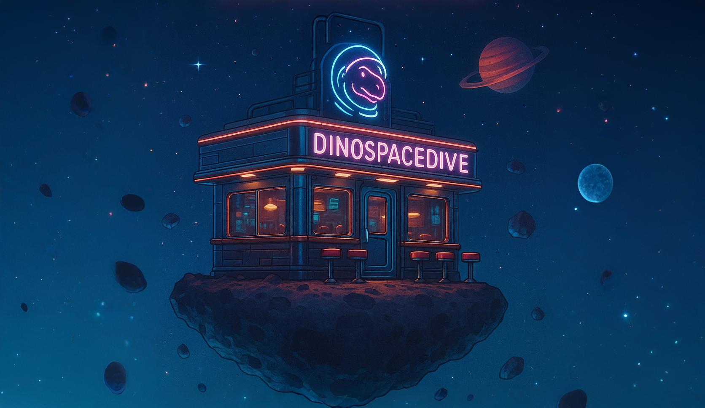
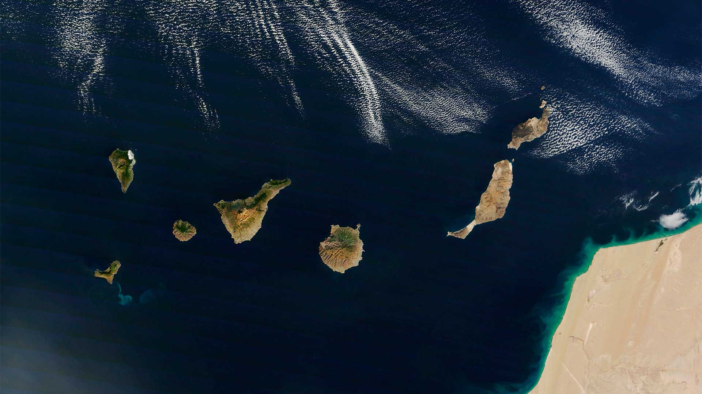

import ImgMD from "@components/ui/ImgMD.astro";
import { Image } from "astro:assets";
import spaceBar from "images/space-bar-wide.jpg";

{/**/}

**Hello, my fellow astronauts!** Welcome to the amazing DinoSpaceDive! The
coolest bar in cyber-space, designed for all the tech-dinos out there!

I’m Alejandro, your host and owner. It’s so great to have you on board!

<Image src={spaceBar} alt="Space Bar" loading="eager" />

This blog is an amazing place where I get to share my little knowledge on
different topics, technologies, cyber-security and automation. I also get to
have a lot of fun sharing random things about myself and my life.

This is not a professional blog by any means! Instead, it is a place where I can
share my knowledge and experiences in a unique way.

## What to Expect from this Blog

Here is a list of the things I’ll be writing about in this blog:

- AppSec: Things like Secure Coding, Web Application Security, DevSecOps, and so
  on. _(future AppSec Engineer in progress)_
- Other Cyber-security topics: Hacking, Triage, Bug Bounty and CTFs.
- Programming and Automation: Python, Bash, Web Development and Chrome
  Extensions.
- Computer and Mac Automation Tips. I love finding better and faster ways to do
  things on my computer.
- A little about my life and trips.

As you can see, it’s a bit of everything. Who knows what I’ll be writing about
in the future? _(I don’t even know yet!)_

## A little about Me (for those interested)

I was born in the beautiful Canary Islands, a Spanish archipelago near Africa. I
really like living here. The people and weather is amazing, and each island has
its own unique charm — especially _El Hierro_.

Since I was young, I have really enjoyed playing sports. I played
football/soccer, tennis and athletics for a while. I still play futsal _(indoor
football)_ in a team now. Every year, I try to go snowboarding or skiing as it
is so fun that I got addicted to it.

I also like to travel a lot with my family and friends. What excites me most
about traveling is discovering and finding unknown places in nature, such as
mountains, beaches, waterfalls, rivers, lakes and valleys.

I’m a bit of a geek and I used to love playing video games on any console, such
as the DS, PS2, PSP, Wii or on any other computer.

### My unexpected career path

I have been interested in computers since I was a teenager _(downloading movies
and music, and pirating my PSP and NDS)_. I didn’t really get into programming
until I started my bachelor’s degree. Since then, I have become immersed in the
world of programming and automation. I really like the fact that you can solve
problems in your own way of thinking.

Right now, I’m the kind of person who would rather spend 20 hours automating
something that could have taken me 10 hours to do manually 🤖.

<ImgMD src="/images/cat-miope.gif" alt="Cat Hacking" astro_enabled={false} />

Once I had finished my Bachelor’s degree, I took a break to think properly about
what I would like to work on in the future. Although I enjoy programming, I want
to find a job that I will enjoy in the long term.

While watching Mr. Robot show, I realised that although my degree had taught me
a lot about programming, I still didn’t really understand how computers, the
internet and the web worked. I could not grasp what the main characters were
doing to hack into the computers. So I decided to learn more about it.

During this time, I learnt much more about computers than I did during my
bachelor’s degree. It was less about passing an exam and more about
understanding how computers and the internet work in the real world.

I decided to put my knowledge into the test by taking the OSCP exam. After a
year and a half of studying hacking, I finally passed the OSCP. Then I got a job
in cybersecurity at Hexod, working as part of the Salesforce triage team. If you
want to know more about my career path, just take a look at the timeline on the
[homepage](/).

---

That’s all folks! Now, you know what to expect from this blog and know me a bit.

Oops! I almost forgot to tell you.. Just so you know, I'm a cool, fast
Velociraptor sub-species called: Astro-AleRaptor!

Please come in and let me know below what kind of dino are you! 🦖
